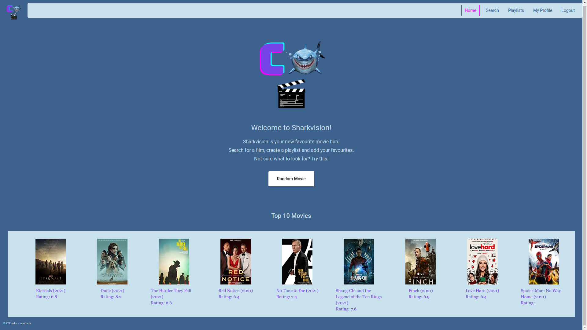
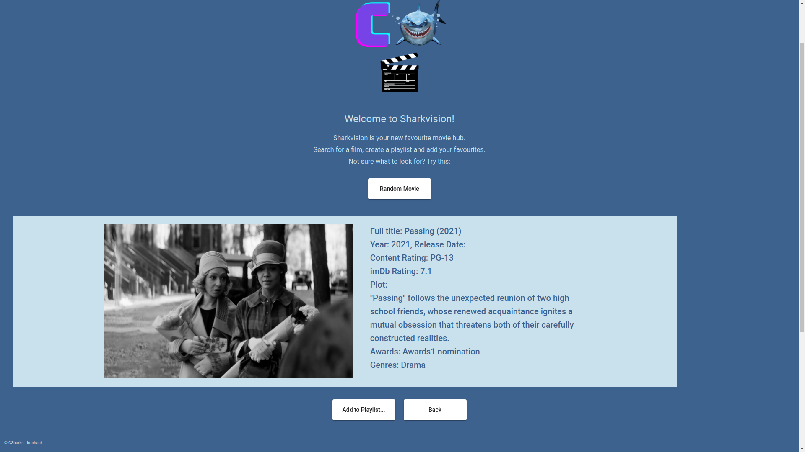
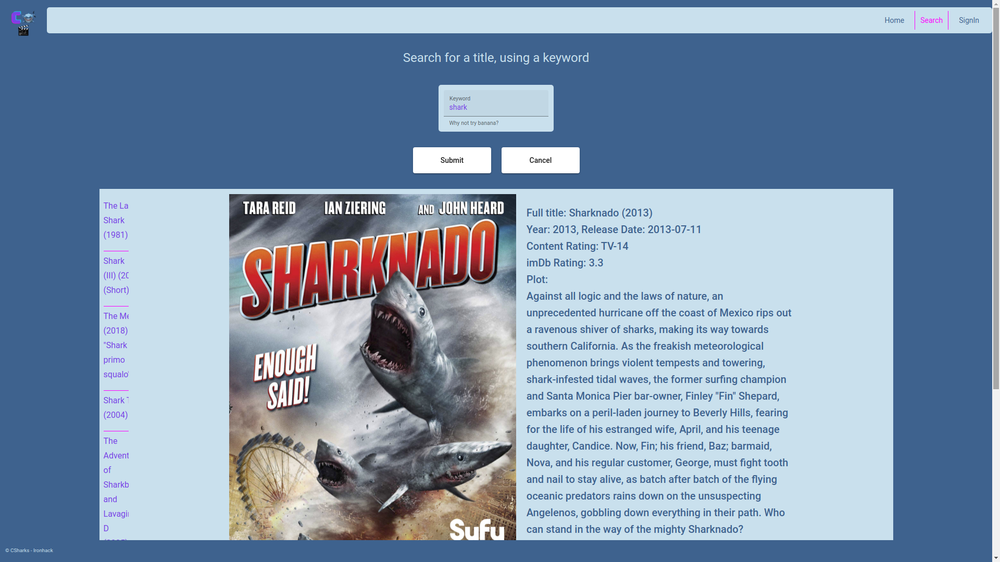
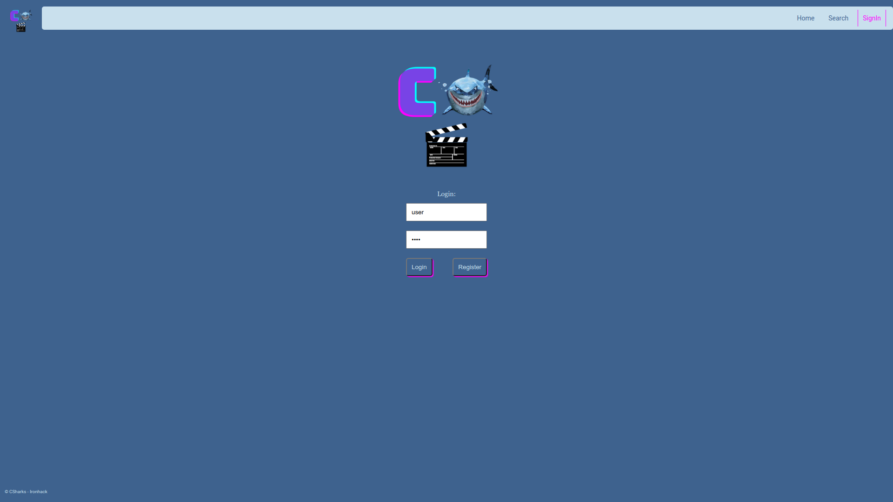
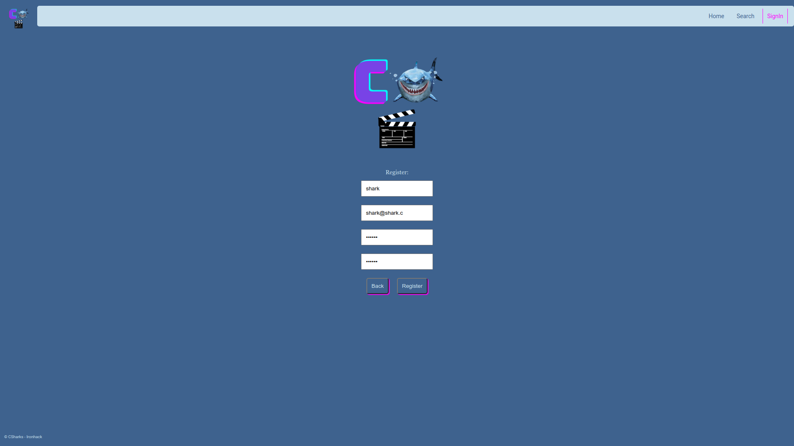
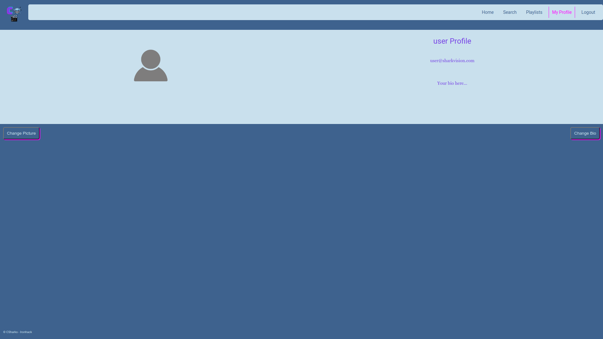
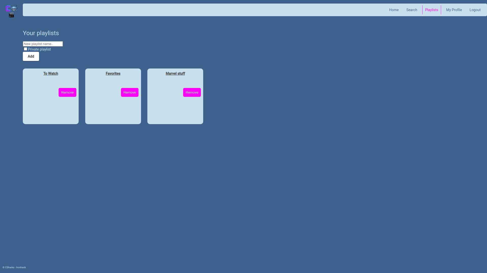
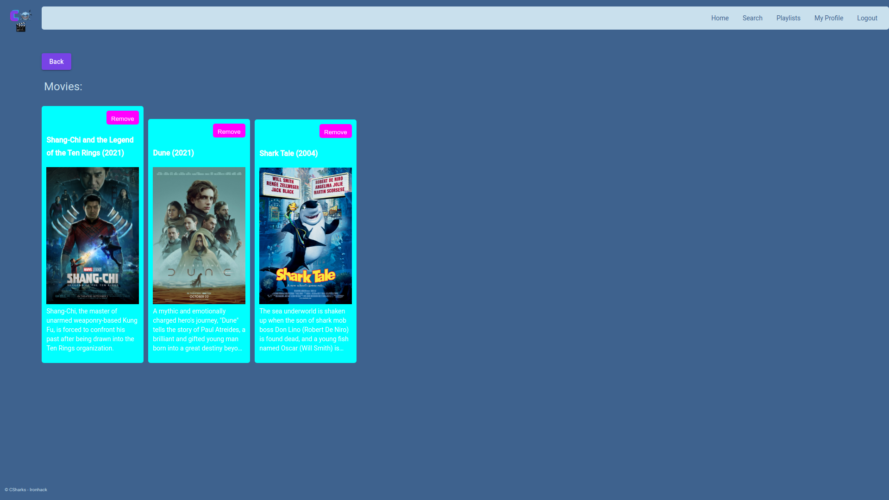

# CSharks - Sharkvision

## Summary

Welcome to your new favourite Movie service. Sharkvision allows you to search for movies, add them to playlists and even recommends a random movie when you can't decide what to watch.

## Table Of Contents

1. [Summary](#summary)
2. [Table Of Contents](#table-of-contents)
3. [About The Project](#about-the-project)
   1. [Project Requirements](#project-requirements)
   2. [Built With](#built-with)
4. [Getting Started - Local Method](#getting-started---local-method)
   1. [Setup - Backend Application](#setup---backend-application)
   2. [Setup - Frontend Application](#setup---frontend-application)
5. [Backend API](#backend-api)
   1. [Security](#security)
   2. [Routes](#routes)
   3. [DTOs](#dtos)
6. [Frontend Application](#frontend-application)
   1. [Homepage](#homepage)
   2. [Searching Movies](#searching-movies)
   3. [SignIn](#signin)
   4. [Profile](#profile)
   5. [Playlists](#playlists)
7. [Contacts](#contacts)

## About The Project

### Project Requirements

Your project must meet all of the requirements below:

#### Core Functionality

1. Include a Java/Spring Boot backend and an Angular frontend.
2. You will have to use the [IMDB API](https://imdb-api.com/api) to retrieve some of the information you want to use in the project (you have to create an account to get your API Key)
3. The project will have at least these sections:
   1. A section to search movies (the search should be case insensitive)
   2. A movie detail
   3. Login/Register section (only registered users can create playlists)
   4. User profile page (if logged)
   5. User playlist section (if logged)
4. Playlists with their respective content will be stored in your backend DB.
5. When searching movies you must make the field case **insensitive** and make it submit when pressing enter as an alternative to pressing the search button.
6. You only can add up to 10 movies per playlist. If you try to add more, a warning message should be displayed.
7. Playlists can be created, updated, or eliminated by the user
8. Users can personalize their account by selecting a profile picture (image url), and writing a bio.
9. Unexpected routes and errors should be appropriately managed.
10. Include adequate and complete documentation of your backend API in the `README.md` file.

#### Optional Requirements

1. Users can search for other users profiles and see their playlists

2. Users can create public or private playlists (private playlists shouldn't be displayed if searched)

3. Create a section to display the most popular movies (from the API)

### Built With

Technologies used in this project:

- [Java](https://www.java.com/)
- [Spring](https://spring.io/)
- [MySQL](https://www.mysql.com/)
- [GitHub](https://github.com/)
- [Node.js](https://nodejs.org/en/)
- [Angular](https://angular.io/)

## Getting Started - Local Method

The project contains a separate backend and a frontend part. To locally run the web application both parts must be setup and operational.

### Setup - Backend Application

- Clone the backend repository: [https://github.com/EN-IH-WDPT-JUN21/CSharks-BackEndHomework](https://github.com/EN-IH-WDPT-JUN21/CSharks-BackEndHomework)
- Setup the following database name and user, or setup your own database by changing the values in the `application.properties` file

```sql
CREATE DATABASE MoviesBackendDatabase;

CREATE USER 'CSharks'@'localhost' IDENTIFIED BY 'c5hark5';
GRANT ALL PRIVILEGES ON *.* TO 'CSharks'@'localhost';
FLUSH PRIVILEGES;
```

- Run the following command to start the spring application: `mvn spring-boot:run`, or by using an IDE like IntelliJ IDEA
- The application will be available at: [http://localhost:8000/](http://localhost:8000/)

### Setup - Frontend Application

- Clone the frontend repository: [https://github.com/EN-IH-WDPT-JUN21/CSharks-SharkVisionFrontEnd](https://github.com/EN-IH-WDPT-JUN21/CSharks-SharkVisionFrontEnd)
- Install the dependencies: `npm install`
- Run the following command to start the frontend application: `npm start`
- The application will be available at: [http://localhost:4200/](http://localhost:4200/)

## Backend API

### Security

There are two pre generated profiles. One with the user role and one with the admin role.

**User:**

```javascript
username: user;
password: user;
```

**Admin:**

```javascript
username: admin;
password: admin;
```

This project implements a [JWT](https://jwt.io/) authentication mechanism. The JWT is generated by the backend and sent to the frontend. The frontend uses the JWT to authenticate the user and retrieve information.

To authenticate the user/admin manually (with postman or other tool) you must follow this steps:

- To login with the pretended profile send a post request to the login page: [http://localhost:8000/login](http://localhost:8000/login);
- In the body of the request add the `x-www-form-urlencoded` format and add the following values:
  | key | value |
  | ---------- | ----------------- |
  | `username` | `<username here>` |
  | `password` | `<password here>` |

- The response will contain a JWT token and an expiration date.
- To access the protected routes you must add the JWT token to the `Authorization` header of the request with the following format:
  | key | value |
  | --------------- | --------------------- |
  | `Authorization` | `Bearer <token here>` |

### Routes

#### Public Access

| Port | Route Type | Route                              | Description                                                                                                |
| :--: | :--------: | ---------------------------------- | ---------------------------------------------------------------------------------------------------------- |
| 8000 |    POST    | /movie-app/users/register          | Registers new user, returns user info. Requires body: [**RegisterUserDTO**](#registeruserdto)              |
| 8000 |    POST    | /movie-app/users/validate/username | Checks if username exists in the database, returns boolean. Requires body: [**UsernameDTO**](#usernamedto) |
| 8000 |    POST    | /movie-app/users/validate/email    | Checks if email address exists in the database, returns boolean. Requires body: [**EmailDTO**](#emaildto)  |

#### Registered User Access

| Port | Route Type | Route                                                  | Description                                                                                                                                 |
| :--: | :--------: | ------------------------------------------------------ | ------------------------------------------------------------------------------------------------------------------------------------------- |
| 8000 |    GET     | /movie-app/users/authenticated                         | Returns authenticated user info.                                                                                                            |
| 8000 |   PATCH    | /movie-app/users/authenticated                         | Changes authenticated user details, returns user info. Request parameters: **picture**(optional), **bio**(optional), **password**(optional) |
| 8000 |    GET     | /movie-app/playlists/user/authenticated                | Returns all playlists from the authenticated user.                                                                                          |
| 8000 |    GET     | /movie-app/playlists/{playlistId}                      | Returns playlist by id, accessible if owner or visible. Requires **playlistId: long**                                                       |
| 8000 |    GET     | /movie-app/playlists/visible                           | Returns visible playlists or visible by search query. Request parameter: **search**                                                         |
| 8000 |    GET     | /movie-app/playlists/{playlistId}/movies               | Returns list of movies ids by playlist id, accessible if owner. Requires **playlistId: long**                                               |
| 8000 |    POST    | /movie-app/users/authenticated/createPlaylist          | Creates a playlist for the authenticated user, returns playlist info. Requires body: [**PlaylistDTO**](#playlistsdto)                       |
| 8000 |    POST    | /movie-app/users/authenticated/createPlaylistWithMovie | Creates a playlist for the authenticated user, returns playlist info. Requires body: [**PlaylistWithMovieDTO**](#playlistwithmoviedto)      |
| 8000 |   DELETE   | /movie-app/playlists/{playlistId}/delete               | Deletes playlist, accessible if owner. Requires **playlistId: long**                                                                        |
| 8000 |    PUT     | /movie-app/playlists/{playlistId}/add/{titleId}        | Adds movie to playlist, accessible if owner of playlist, returns playlist info. Requires **playlistId: long**, **titleId: string**          |
| 8000 |    PUT     | /movie-app/playlists/{playlistId}/remove/{titleId}     | Removes movie from playlist, accessible if owner of playlist, returns playlist info. Requires **playlistId: long**, **titleId: string**     |

#### Admin Access

| Port | Route Type | Route                                      | Description                                                                                                                                                    |
| :--: | :--------: | ------------------------------------------ | -------------------------------------------------------------------------------------------------------------------------------------------------------------- |
| 8000 |    GET     | "/movie-app/users/all"                     | Returns all users.                                                                                                                                             |
| 8000 |    GET     | "/movie-app/users/{userId}"                | Returns user info by id. Requires **userId: long**                                                                                                             |
| 8000 |   PATCH    | "/movie-app/users/{userId}"                | Changes user details by id, returns user info. Requires **userId: long**. Request parameters: **picture**(optional), **bio**(optional), **password**(optional) |
| 8000 |    GET     | "/movie-app/playlists/all"                 | Returns all playlists.                                                                                                                                         |
| 8000 |    GET     | "/movie-app/playlists/user/{userId}"       | Returns playlists by user id. Requires **userId: long**                                                                                                        |
| 8000 |    POST    | "/movie-app/users/{userId}/createPlaylist" | Creates a playlist for a specific user by id, returns user info. Requires **userId: long**. Requires body: [**PlaylistDTO**](#playlistsdto)                    |

### DTOs

#### RegisterUserDTO

```javascript
{
    username: String,
    emailAddress: String,
    password: String
}
```

#### UsernameDTO

```javascript
{
    username: String
}
```

#### EmailDTO

```javascript
{
    emailAddress: String
}
```

#### UsersDTO

```javascript
{
    username: String,
    emailAddress: String,
    password: String,
    pictureUrl: String,
    bio: String,
    playlistId: List<PlaylistDTO>
}
```

#### PlaylistsDTO

```javascript
{
    playlistId: Long,
    user: Users,
    name: String,
    visible: Boolean
}
```

#### PlaylistWithMovieDTO

```javascript
{
    playlistId: Long,
    user: Users,
    name: String,
    visible: Boolean,
    movieId: String
}
```

#### MoviesDTO

```javascript
{
    titleId: Long,
    name: String,
    visible: Boolean,
    playlists: Set<PlaylistsDTO>
}
```

## Frontend Application

The frontend application allows the user to search movies and manage their playlists.
It's functionality can be divided into the following sections:

- Home page: where it shows the top rated movies and has a random generated button to get a movie;
- Search page: where the user can search for a movie by title;
- Sign in page: where the user can sign in with their username and password, or register an account;
- User profile page: where the user can see their information and edit it;
- Playlist page: where the user can see and edit their playlists and add movies to them.

### Homepage





### Searching Movies



### SignIn





### Profile



### Playlists





## Contacts

- Jegor Chomczuk - [GitHub](https://github.com/jegor-chomczuk)
- João Afonso Silva - [GitHub](https://github.com/Joaodss)
- Maddy McMurray - [GitHub](https://github.com/MaddyKilmurray)
- Natalia Norberciak - [GitHub](https://github.com/NatNorb)
